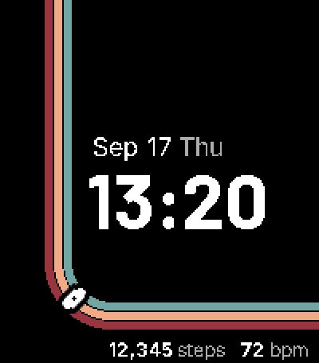
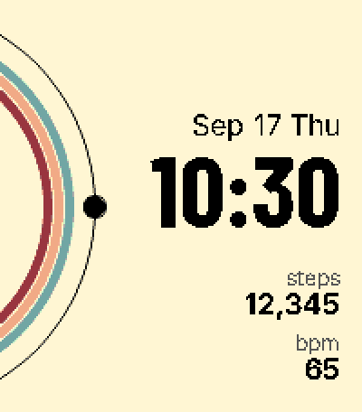

# Lonetrail

Pebble Time 2 向けウォッチフェイス。1つのコードベースから2つのデザインを .pbw として配布しています。

| Route | Orbit |
|---|---|
|  |  |
| 路線図の3本線を駅マーカーが1日かけて上端から曲線を回って右端まで進む | 軌道上の月が分に合わせて進み、1時間かけて満ち欠けする |

共通の表示: 時刻、日付(月 日 曜日)、今日の歩数、心拍数。

## 対応機種

- Pebble Time 2(platform `emery`、200×228、64色)のみ

## インストール

1. [Releases](../../releases) から `lonetrail-route-<version>.pbw` または `lonetrail-orbit-<version>.pbw` をスマホにダウンロードする
2. ダウンロードした `.pbw` を Pebble アプリで開く(ファイルアプリやブラウザのダウンロード一覧からタップ)
3. 時計にインストールされたらウォッチフェイスとして選ぶ

両方入れて切り替えて使えます(別々のアプリとして登録されます)。

## 状態表示

| 状態 | Route | Orbit |
|---|---|---|
| Bluetooth 切断 | 時刻の下にモールス符号で `NO LINK`(短いバイブ1回) | 同心円が灰色になる(短いバイブ1回) |
| 電池 20% 以下 | 時刻の下にモールス符号で `LOW BAT` | 月が赤くなる |
| 歩数・心拍が取れない | `--` | `--` |

心拍は時計を装着していて計測済みのときだけ表示されます。

## ビルド

[pebble-tool](https://developer.repebble.com/sdk)(Core Devices 版)と SDK が必要です。

```sh
pebble build                       # Orbit を build/ に出す(開発用)
pebble install --emulator emery    # エミュレータで確認
scripts/build-all.sh               # Route / Orbit の .pbw を dist/ に出す
```

`v*` タグを push すると GitHub Actions が両方をビルドして Release に添付します。

## フォント

- [Barlow](https://fonts.google.com/specimen/Barlow) / [Barlow Condensed](https://fonts.google.com/specimen/Barlow+Condensed)(時刻)
- [Inter](https://fonts.google.com/specimen/Inter)(日付・数値)

いずれも SIL Open Font License。ライセンス全文は `resources/fonts/` にあります。
